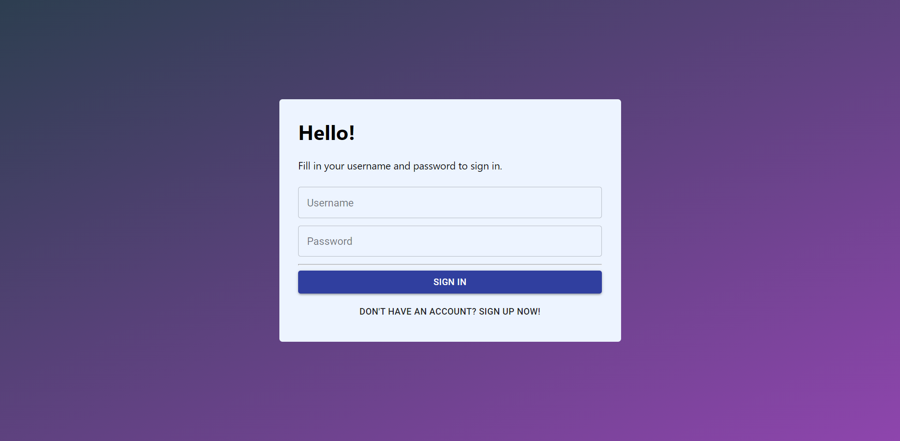
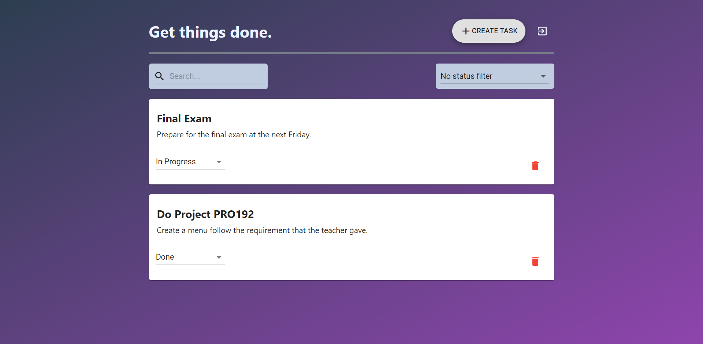

#  Task Management

## [Live demo](https://youtu.be/8QvVxK2__P4) or [Try it here](https://task-management-r-n-151101.web.app)
**Note:** May take a few minutes to start the backend server due to Heroku need time to wake up

## What is Task Management?
- A web application that may save you from missing tasks. But this is still a simple one.
- I strongly recommend you to enhance this project if you want to use it on production or you can just refer this project.
- Preventing from abusing the demo server, I limited the number of user and task per user to 3 and 10 respectively.
- Below is 3 users account:

| Username |   Password   |
|:--------:|:------------:|
|  user1   |   Password1  | 
|  user2   |   Password2  |
|  user3   |   Password3  |

`The more full feature is comming soon!`

## Technology
- Frontend
  - React - A JavaScript library for building user interfaces
  - Create React App - React starter template
  - MobX - State Management
  - Material UI - UI components
  - Styled-components - Styling
  - Typescript - Static Type Checker
- Backend
  - NestJS - Server Core
  - Typeorm + Postgres - Database
  - Passport - Authentication
  - Jest - Testing
  - Docker - Operation

## Some preview images



## Available Scripts
- To advoid the complexity of setup client and server, I strongly recommend you to setup with `Docker`
- If you want to run Book Playlist without `Docker` or run separately, read the `README.md` in `client` and `server` folder.
- In the project directory, you can run following commands to setup with `Docker`:

## Start up docker containers
```
yarn start
```

## Shutdown docker containers
```
yarn stop
```

## Setup Pgadmin
- Go to `localhost:16543` and login with `admin@admin.com` and `admin` as username and password respectively.
- Click `Add New Server`
- In General tab, enter name of the database server (this is just an abstract name so you can name it anyname you want).
- In Connection tab, enter `postgresql`, `task_management`, `username` and `password` as host, database, username and password.
- Leave all other fields as default value then click `Save`.
=> That's all, you are connected to database in your local container. Try to explore with Pgadmin more and have fun. 

## Reference

This application is configuration of [task-management-frontend](https://github.com/arielweinberger/task-management-frontend) of [Ariel Weinberger](https://github.com/arielweinberger).

# License & copyright

© Kirin Tran, FPT University TP.HCM
Licensed under the [MIT LICENSE](LICENSE).